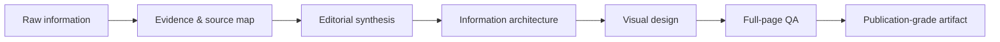

<div align="center">

# VisualRefinery

### Turn raw information into publication-grade visual artifacts.

**Research it. Refine it. Design it. Ship it.**

[](LICENSE)


VisualRefinery is an open, domain-agnostic workflow and agent skill for transforming messy source material into polished, evidence-grounded, visually coherent deliverables.

It is not a slide template. It is not a prompt that says “make this prettier.” It is a production system for deciding **what matters, what is true, how it should be structured, how it should look, and whether the final artifact actually works at full-page scale.**

</div>

---

## Why VisualRefinery?

Most AI artifact workflows optimize for one thing: **successful file generation**.

VisualRefinery optimizes for the finished work.

A document can compile and still be poor. A deck can contain every requested fact and still be unreadable. A report can look polished while quietly mixing unsupported claims, stale information, decorative imagery, broken hierarchy, or clipped text.

VisualRefinery treats the artifact as a complete editorial product:



The core principle is simple:

> **Design is the visible consequence of good judgment, not decoration applied after the fact.**

---

## What it can produce

VisualRefinery is intentionally not tied to one profession or output format. It can guide the creation or revision of:

- analytical reports and decision briefs;
- slide decks and conference presentations;
- one-pagers and executive summaries;
- research and academic communication;
- technical explainers and architecture documents;
- educational and training materials;
- policy and public-information documents;
- product and service comparisons;
- visual guides, handbooks, and field references;
- magazine-style PDFs and client-facing publications;
- evidence-based clinical or scientific teaching artifacts;
- travel, hospitality, and destination reports;
- other high-stakes visual deliverables.

The subject changes. The quality system does not.

---

## The refinery pipeline

VisualRefinery uses six connected stages.

### 1. Evidence

Start with the source material, not the layout.

Identify the decision the artifact must support, map the available evidence, verify unstable facts, distinguish fact from inference, and preserve the limits of the underlying material.

### 2. Synthesis

Turn sources into an argument, explanation, or decision pathway.

Do not stack quotations, facts, reviews, or citations as disconnected fragments. Explain what they mean and why they matter.

### 3. Editorial architecture

Build a narrative rather than a pile of cards.

Use conclusion-led headings, one dominant idea per page or slide, intentional sequencing, and a level of detail appropriate to the reader.

### 4. Visual design

Create hierarchy, not ornament.

Typography, imagery, diagrams, tables, spacing, and color should clarify the content. Every visual element must earn its place.

### 5. Full-page QA

Render the actual artifact.

Inspect every complete page or slide at readable scale. Check rhythm using a contact sheet. Re-render every corrected page. Automated layout checks are useful, but they do not replace visual inspection.

### 6. Delivery

Ship a recoverable, editable, verifiable result.

Preserve source files where appropriate, keep citations and credits usable, and avoid overwriting the last known-good version before the revision passes QA.

---

## What makes it different

| Typical generation workflow | VisualRefinery |
|---|---|
| Starts from a template | Starts from the decision and evidence |
| Treats sources as text to summarize | Builds a source map and resolves conflicts |
| Fills slides with content | Assigns one dominant message per page |
| Uses imagery as decoration | Requires each image to answer a reader question |
| Accepts tiny type to fit content | Protects readability and restructures when needed |
| Checks whether the file opens | Checks whether the artifact communicates |
| Relies on programmatic validation | Requires full-page visual inspection |
| Optimizes for “generated” | Optimizes for “publishable” |

---

## Core quality gates

A VisualRefinery artifact is not finished until it passes these gates:

**Content integrity**  
Claims are supported, changing facts are current, units and comparison conditions are explicit, and source-derived meaning has not been silently altered.

**Editorial quality**  
The artifact reads like coherent professional communication rather than assembled fragments or generic AI prose.

**Visual quality**  
Hierarchy is clear; typography is readable; imagery is relevant; nothing is clipped, distorted, hidden, or unintentionally empty.

**Full-page inspection**  
Every page or slide is rendered and reviewed as a complete composition—not only as extracted text or cropped screenshots.

**Technical validation**  
Fonts, links, glyphs, images, page numbers, citations, and editable sources behave as intended.

**Honest delivery**  
No QA or verification step is claimed unless it was actually performed.

---

## Repository structure

```text
VisualRefinery/
├── SKILL.md                    # Domain-agnostic core workflow
├── README.md                   # Project overview and usage
├── profiles/                   # Optional domain adaptations
│   ├── academic-research.md
│   ├── business-strategy.md
│   ├── education-training.md
│   ├── medical-clinical.md
│   └── travel-hospitality.md
├── templates/                  # Reusable production records
│   ├── claim-ledger.md
│   ├── asset-manifest.md
│   └── qa-log.md
├── examples/
│   └── README.md               # Example directions and contribution guide
├── CONTRIBUTING.md
├── CHANGELOG.md
└── LICENSE
```

The core skill deliberately avoids assuming a profession, audience, output format, or visual style. Domain profiles add specialized considerations without contaminating the general workflow.

---

## Quick start

### Use the core skill

Give your agent access to [`SKILL.md`](SKILL.md) as project instructions, a reusable skill, or a workflow reference.

Then provide the source material and the deliverable you want, for example:

```text
Use VisualRefinery to turn these research notes into a concise 12-slide
conference presentation for a mixed technical audience. Preserve the
important uncertainty, use native charts where possible, cite load-bearing
claims, and perform full-slide visual QA before delivery.
```

Or:

```text
Use VisualRefinery to convert this folder of source material into a polished
client-facing PDF. Decide the clearest information architecture from the
content instead of forcing it into a fixed template.
```

### Add a profile when useful

The files in [`profiles/`](profiles/) are overlays, not forks of the core workflow.

For example, a clinical teaching deck can combine:

```text
SKILL.md
+ profiles/medical-clinical.md
```

while a destination comparison can combine:

```text
SKILL.md
+ profiles/travel-hospitality.md
```

If no profile fits, use the core skill by itself.

---

## Design philosophy

### Evidence before aesthetics

A beautiful artifact with weak evidence is still weak.

### Editorial judgment before layout

The page should reflect the argument. The argument should not be distorted to fit the page.

### Real visuals before filler

Prefer meaningful photographs, maps, diagrams, charts, screenshots, technical figures, or other subject-specific evidence over generic decoration.

### Readability before density

When a page does not fit, restructure the information. Do not solve an editorial problem by making the text tiny.

### Inspection before approval

If nobody has looked at the complete rendered page, it has not passed visual QA.

### General core, specialized edges

The core remains reusable across disciplines. Domain-specific constraints belong in profiles.

---

## Profiles

The initial release includes optional guidance for several common contexts:

- **Academic & Research** — evidence communication, methods, uncertainty, figures, citations.
- **Business & Strategy** — decisions, trade-offs, KPI context, executive readability.
- **Education & Training** — learning objectives, cognitive load, sequencing, retrieval cues.
- **Medical & Clinical** — clinical thresholds, guideline currency, doses, contraindications, patient privacy.
- **Travel & Hospitality** — itinerary burden, accessibility, realistic experience, pricing, service variability.

Profiles should remain compact. If a rule is useful across domains, it belongs in the core instead.

---

## Templates

VisualRefinery includes lightweight templates for the invisible work behind a strong artifact:

- [`claim-ledger.md`](templates/claim-ledger.md) — track load-bearing claims, sources, versions, and inference status;
- [`asset-manifest.md`](templates/asset-manifest.md) — track images, figures, licenses, provenance, and usage;
- [`qa-log.md`](templates/qa-log.md) — record page-level visual and technical checks.

These are production aids. They do not need to appear in the finished client-facing artifact.

---

## What VisualRefinery is not

VisualRefinery is **not**:

- a replacement for domain expertise;
- a fixed visual theme;
- a collection of decorative templates;
- a guarantee that every source is correct;
- an excuse to fabricate missing information;
- a reason to expose private chain-of-thought or internal reasoning;
- a substitute for human review when the consequences of error are high.

It is a framework for making the research, editorial, design, and QA process more disciplined and reproducible.

---

## Contributing

Visual communication differs across disciplines, cultures, accessibility needs, and publication environments. Contributions are welcome—especially:

- new domain profiles;
- better QA heuristics;
- accessibility improvements;
- example artifacts with source material;
- reproducible visual-regression or layout checks;
- guidance for charts, diagrams, maps, posters, and other artifact types;
- integrations with different agent workflows.

Please read [`CONTRIBUTING.md`](CONTRIBUTING.md) before opening a pull request.

---

## Roadmap

Planned directions include:

- reference examples with before/after comparisons;
- accessibility and color-contrast guidance;
- chart and data-visualization profile;
- poster and one-page brief profile;
- automated preflight checks that complement manual QA;
- reusable test fixtures for clipping, overflow, bad contrast, and broken hierarchy;
- interoperability examples for different agent environments.

---

## License

VisualRefinery is released under the [MIT License](LICENSE).

Use it, adapt it, extend it, and contribute improvements back if you can.

---

<div align="center">

**Raw information is only the beginning.**

**Refine the evidence. Refine the story. Refine the artifact.**

</div>
