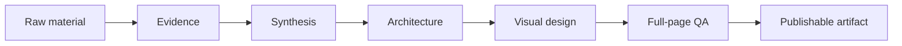

<div align="center">

# ✦ VisualRefinery

### Turn raw information into publication-grade visual artifacts.

**Research → Refine → Structure → Design → Inspect → Ship**

[](https://agentskills.io/)
[](LICENSE)
[](CHANGELOG.md)
[](https://github.com/jerry0327/VisualRefinery/actions/workflows/validate.yml)

**A domain-agnostic Agent Skill for turning messy source material into polished reports, decks, one-pagers, guides, posters, and other high-stakes visual deliverables.**

[Quick start](#-quick-start) · [How it works](#-the-refinery-pipeline) · [What it can make](#-what-it-can-make) · [Skill structure](#-skill-structure) · [Contributing](CONTRIBUTING.md)

</div>

---

## Why VisualRefinery?

Most AI artifact workflows stop when the file is generated.

VisualRefinery asks a harder question:

> **Would a careful human editor, designer, analyst, or subject-matter expert be willing to publish it?**

A document can compile and still be weak. A deck can contain every requested fact and still be unreadable. A report can look polished while quietly mixing stale claims, decorative imagery, broken hierarchy, tiny type, clipped text, or unsupported conclusions.

VisualRefinery treats visual output as a complete production discipline:



**Design is the visible consequence of good judgment—not decoration applied after the fact.**

---

## ⚡ Quick start

### Install with the Agent Skills CLI

```bash
npx skills add jerry0327/VisualRefinery --skill visual-refinery
```

Or browse before installing:

```bash
npx skills add jerry0327/VisualRefinery --list
```

### Install with GitHub CLI skill support

```bash
gh skill install jerry0327/VisualRefinery visual-refinery
```

### Manual use

Copy [`skills/visual-refinery/`](skills/visual-refinery/) into your agent's skills directory, or give the agent access to [`SKILL.md`](skills/visual-refinery/SKILL.md) as project instructions.

Then ask naturally:

```text
Use VisualRefinery to turn these research notes into a concise conference deck.
Preserve uncertainty, cite load-bearing claims, use meaningful visuals, and
inspect every rendered slide before delivery.
```

```text
Use VisualRefinery to convert this folder of source material into a polished
client-facing PDF. Choose the information architecture from the content rather
than forcing it into a fixed template.
```

VisualRefinery is written to be **agent-agnostic**. The core skill follows the open `SKILL.md` pattern and can also be used as a plain instruction file in environments that do not provide native skill discovery.

---

## 🧭 The refinery pipeline

| Stage | Question | Output |
|---|---|---|
| **1. Evidence** | What is true, current, and supportable? | source map + claim ledger |
| **2. Synthesis** | What does the evidence actually mean? | argument / explanation / decision logic |
| **3. Architecture** | What sequence best serves the reader? | page / slide narrative |
| **4. Design** | What visual form clarifies that message? | typography, imagery, charts, diagrams, layout |
| **5. Inspection** | Does the rendered artifact work at full-page scale? | visual QA + corrections |
| **6. Delivery** | Is the result editable, traceable, and technically sound? | final artifact + supporting records |

The workflow is intentionally stricter than “make it pretty.” It is designed to prevent common failure modes such as evidence-free polish, card-wall layouts, gratuitous imagery, tiny text, silent factual drift, and claiming QA that never happened.

---

## 🧩 What it can make

VisualRefinery is not tied to one profession or format.

| Area | Example outputs |
|---|---|
| **Research & academia** | conference decks, literature briefs, posters, research summaries |
| **Business & strategy** | executive briefs, decision memos, board decks, competitive analyses |
| **Technical** | architecture explainers, system overviews, implementation guides |
| **Education** | teaching decks, training modules, study guides, visual handbooks |
| **Data & analytics** | narrative dashboards, chart-led reports, KPI readouts |
| **Policy & public information** | public guides, policy briefs, explainer documents |
| **Product & service** | comparisons, launch briefs, product explainers |
| **Clinical & scientific** | evidence-based teaching materials and decision aids |
| **Travel & hospitality** | destination reports, itinerary comparisons, hotel/service analysis |
| **Creative / editorial** | magazine-style PDFs, visual essays, curated guides |

The subject changes. **The quality system does not.**

---

## What makes it different

| Typical artifact generation | VisualRefinery |
|---|---|
| Starts from a template | Starts from the reader's decision and evidence |
| Summarizes sources | Maps claims, conflicts, uncertainty, and freshness |
| Fills pages with content | Gives each page a dominant job |
| Uses images as decoration | Requires visuals to answer a reader question |
| Shrinks text until it fits | Restructures information to protect readability |
| Checks whether the file opens | Checks whether the artifact communicates |
| Relies on automated checks | Requires complete-page visual inspection |
| Optimizes for “generated” | Optimizes for **publishable** |

---

## 🔍 Full-page QA is a first-class feature

VisualRefinery treats visual inspection as part of generation, not an optional afterthought.

A substantial artifact should be:

1. rendered page by page;
2. reviewed as a contact sheet for rhythm and consistency;
3. inspected one complete page or slide at a time at readable scale;
4. corrected where needed;
5. re-rendered and re-inspected after changes;
6. technically validated for clipping, glyphs, links, images, and file integrity.

Automated preflight checks are useful. **They do not replace looking at the actual page.**

---

## 🏗 Skill structure

VisualRefinery follows the self-contained Agent Skill pattern used by mature skill repositories:

```text
VisualRefinery/
├── skills/
│   └── visual-refinery/
│       ├── SKILL.md
│       ├── references/
│       │   ├── artifact-branches.md
│       │   ├── domain-profiles.md
│       │   ├── visual-design.md
│       │   └── qa-checklist.md
│       ├── assets/
│       │   └── templates/
│       │       ├── claim-ledger.md
│       │       ├── asset-manifest.md
│       │       └── qa-log.md
│       └── evals/
│           └── evals.json
├── examples/
│   └── README.md
├── scripts/
│   └── validate_skill.py
├── .github/workflows/
│   └── validate.yml
├── AGENTS.md
├── CONTRIBUTING.md
├── SECURITY.md
├── CHANGELOG.md
└── LICENSE
```

The core `SKILL.md` stays compact enough to load efficiently. Specialized rules live in `references/` and are loaded only when relevant.

---

## 🧠 Progressive disclosure

VisualRefinery deliberately separates universal behavior from optional detail.

### Core skill

[`skills/visual-refinery/SKILL.md`](skills/visual-refinery/SKILL.md) contains the workflow that should apply across domains:

- evidence before design;
- reader-aware synthesis;
- information architecture;
- visual hierarchy;
- meaningful imagery;
- full-page inspection;
- technical validation;
- honest delivery.

### References

The agent reads supporting references only when needed:

- [`visual-design.md`](skills/visual-refinery/references/visual-design.md) — typography, layout, imagery, charts, color, accessibility;
- [`artifact-branches.md`](skills/visual-refinery/references/artifact-branches.md) — slides, reports, one-pagers, posters, data-led artifacts;
- [`domain-profiles.md`](skills/visual-refinery/references/domain-profiles.md) — optional considerations for research, business, education, technical, medical, travel, and other domains;
- [`qa-checklist.md`](skills/visual-refinery/references/qa-checklist.md) — full-page and technical preflight.

This keeps the project broad without making every user pay the context cost of every domain.

---

## ✅ Quality gates

A VisualRefinery artifact is not finished until the relevant gates pass.

**Content integrity** — load-bearing claims are supported; unstable facts are checked; source meaning is preserved.

**Editorial quality** — the artifact reads as a coherent piece of professional communication, not a stack of generated cards.

**Visual quality** — hierarchy is clear; typography is readable; visuals are relevant; nothing is accidentally empty, distorted, clipped, or hidden.

**Accessibility** — contrast, legibility, color dependence, reading order, and audience constraints are considered where relevant.

**Full-page inspection** — complete rendered pages are reviewed, not only extracted text or cropped screenshots.

**Technical validation** — links, glyphs, fonts, images, page numbers, citations, and editable sources behave as intended.

**Honest delivery** — no verification step is claimed unless it was actually performed.

---

## 🧪 Evals and validation

The repository includes:

- realistic cross-domain prompts under [`evals/evals.json`](skills/visual-refinery/evals/evals.json);
- a structural validator under [`scripts/validate_skill.py`](scripts/validate_skill.py);
- GitHub Actions validation on pushes and pull requests.

The initial eval set intentionally spans unrelated domains. A domain-agnostic skill should prove that it generalizes rather than merely restating one original use case.

---

## 🎨 Design philosophy

### Evidence before aesthetics
A beautiful artifact with weak evidence is still weak.

### Editorial judgment before layout
The page should reflect the argument. The argument should not be distorted to fit the page.

### Meaningful visuals before filler
Prefer subject-specific photographs, diagrams, charts, maps, screenshots, or figures over generic decoration.

### Readability before density
When a page does not fit, restructure the information. Do not solve an editorial problem by making the type tiny.

### Inspection before approval
If nobody has looked at the complete rendered page, it has not passed visual QA.

### General core, specialized edges
Rules that are universal belong in the core. Domain-specific constraints belong in references.

---

## What VisualRefinery is not

VisualRefinery is not:

- a fixed visual theme;
- a collection of decorative templates;
- a replacement for domain expertise;
- permission to fabricate missing facts or sources;
- a guarantee that every input source is correct;
- a reason to expose private chain-of-thought;
- a substitute for qualified human review when consequences are high.

It is a reusable production framework for making **research, editorial judgment, visual design, and QA more disciplined and reproducible**.

---

## 🤝 Contributing

Contributions are welcome—especially:

- new domain profiles that remain genuinely optional;
- better visual QA heuristics;
- accessibility guidance;
- reproducible eval cases;
- chart, map, poster, and diagram guidance;
- before/after examples using redistributable source material;
- integrations with additional Agent Skills hosts.

See [`CONTRIBUTING.md`](CONTRIBUTING.md).

---

## Roadmap

- [ ] public before/after example gallery
- [ ] accessibility-focused eval set
- [ ] data-visualization reference profile
- [ ] poster and one-page brief examples
- [ ] optional deterministic visual preflight scripts
- [ ] richer cross-agent installation docs
- [ ] community domain profiles

---

## License

MIT. See [`LICENSE`](LICENSE).

<div align="center">

### Raw information is only the beginning.

**Refine the evidence. Refine the story. Refine the artifact.**

</div>
